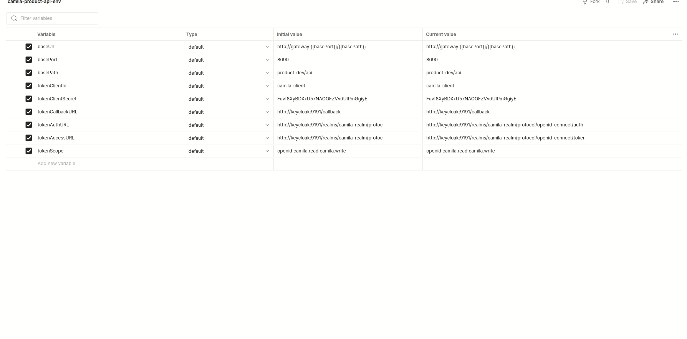

# product-api-docs

API client resources for interacting with Camila Services.

| Tool                                 | Description                                                                 |
|--------------------------------------|-----------------------------------------------------------------------------|
| [Postman](https://www.postman.com/)  | Cloud-based API platform with collections, environments, and visual testing |
| [Bruno](https://www.usebruno.com/)   | Git-friendly, offline-first API client with plain text collections          |

## 📬 Postman


| File                                                                                                               | Description                      |
|--------------------------------------------------------------------------------------------------------------------|----------------------------------|
| [postman/camila-product-api.postman_collection.json](postman/camila-product-api.postman_collection.json)           | Product API endpoint collection  |
| [postman/camila-product-api-env.postman_environment.json](postman/camila-product-api-env.postman_environment.json) | Environment variables            |

### Usage

1. Open Postman and click **Import**
2. Select both the collection and environment JSON files
3. Set the imported environment as active
4. Execute requests against the running service

### Demonstration



## 🐶 Bruno

### Collection Structure

```
bruno/camila-services/
├── collections/     # API request collections
├── environments/    # Environment configurations
└── workspace.yml    # Bruno workspace definition
```

### Usage

1. Open Bruno and click **Open Collection**
2. Navigate to `.docs/api/bruno/camila-services` and select the workspace
3. Choose the desired environment
4. Execute requests against the running service
