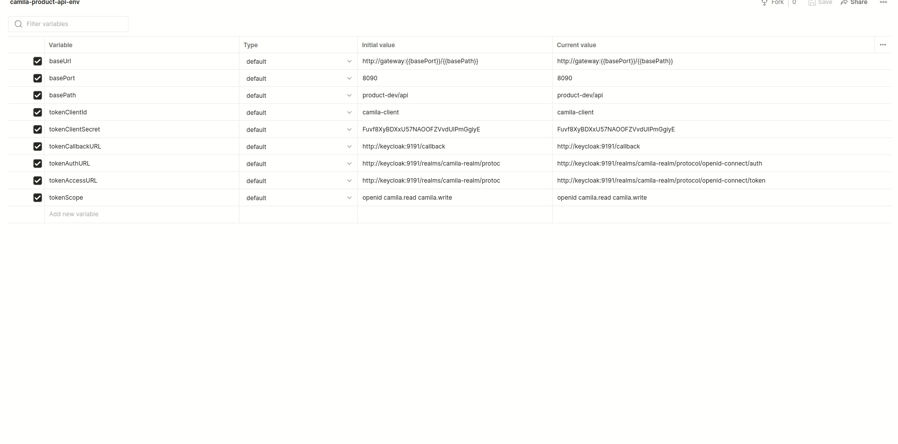

# camila-services-api-docs

> [Summary](#-summary)
  • [Usage](#-usage)

## 📜 Summary

---

Resources for use in [Postman](https://www.postman.com/)

## 🌐 Usage

---

### Index

| File                                                                            | Description                        |
|---------------------------------------------------------------------------------|------------------------------------|
| [camila-product-collection](./camila-product-api.postman_collection.json)       | Contains the service endpoints     |
| [camila-product-environment](./camila-product-api-env.postman_environment.json) | Contains the environment variables |

### Demonstration

