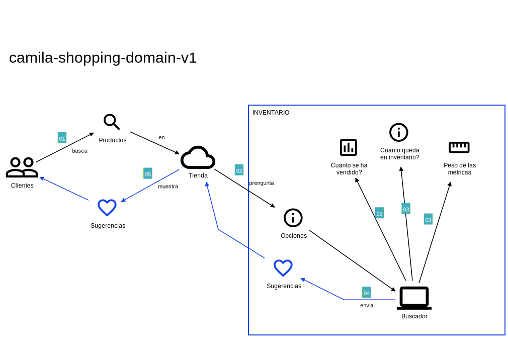

[](CODE_OF_CONDUCT.md)

<p align="center" style="text-align: center">
  
</p>

<p align="center" style="text-align: center">
  <bold>Java</bold> Side Project
</p>

<p align="center" style="text-align: center">
  <a href="https://alistair.cockburn.us/hexagonal-architecture/"></a>
  <a href="https://www.reactivemanifesto.org/"></a>
  <a href="https://microservices.io/"></a>
  <a href="https://oauth.net/2/"></a>
  <a href="https://martinfowler.com/articles/serverless.html"></a>
</p>

> It is recommended to use dark mode UI to read this!

## Technologies

| Development                                                                                                                                                                                                                                                                                                                                                                                                                                                                                                                                                                                                                                                                                                                                                                                                                                                                                                       | Testing                                                                                                                                                                                                                                                                                                                                                                                                                                                                                                                                                                                                                                                                                                                                                                                                        | Deployment                                                                                                                                                                                                                                                                                                                                                                                                                                                                                                                                                                                                     |
|-------------------------------------------------------------------------------------------------------------------------------------------------------------------------------------------------------------------------------------------------------------------------------------------------------------------------------------------------------------------------------------------------------------------------------------------------------------------------------------------------------------------------------------------------------------------------------------------------------------------------------------------------------------------------------------------------------------------------------------------------------------------------------------------------------------------------------------------------------------------------------------------------------------------|----------------------------------------------------------------------------------------------------------------------------------------------------------------------------------------------------------------------------------------------------------------------------------------------------------------------------------------------------------------------------------------------------------------------------------------------------------------------------------------------------------------------------------------------------------------------------------------------------------------------------------------------------------------------------------------------------------------------------------------------------------------------------------------------------------------|----------------------------------------------------------------------------------------------------------------------------------------------------------------------------------------------------------------------------------------------------------------------------------------------------------------------------------------------------------------------------------------------------------------------------------------------------------------------------------------------------------------------------------------------------------------------------------------------------------------|
| [](https://adoptium.net/es/temurin/releases/) <br> [](https://www.graalvm.org/downloads/) <br> [](https://maven.apache.org/) <br> [](https://spring.io/) <br> [](https://spring.io/boot) <br> [](https://spring.io/cloud) <br> [](https://www.mongodb.com/) <br> [](https://www.couchbase.com/) | [](https://junit.org/junit5/) <br> [](https://cucumber.io/) <br> [](https://pitest.org/) <br> [](https://codecentric.github.io/chaos-monkey-spring-boot/) <br> [](https://www.archunit.org/) <br> [](https://jmeter.apache.org/) <br> [](https://testcontainers.com/) | [](https://www.docker.com/) <br> [](https://docs.docker.com/compose/install/) <br> [](https://kubernetes.io/releases/) <br> [](https://github.com/knative/serving/releases/) <br> [](https://aws.amazon.com/es/cli/) |

## Components

| Component                                   | Description                                                      |
|---------------------------------------------|------------------------------------------------------------------|
| [camila-product-api](/camila-product-api)   | Contains a microservice that exposes the product query           |
| [camila-discovery](/camila-discovery)       | Contains a service discoverer                                    |
| [camila-gateway](/camila-gateway)           | Contains a gateway for services                                  |
| [camila-config](/camila-config)             | Contains a central service configurator                          |
| [camila-admin](/camila-admin)               | Contains a service manager (UI)                                  |
| [camila-orchestrator](/camila-orchestrator) | Contains configuration as code to orchestrate project deployment |

## Architecture diagrams


## Domain Storytelling

At **camila.shopping**, the need to improve the organization and presentation of products has been recognized. To address this challenge, the development of a classification algorithm that optimizes the user experience when searching for such products has been proposed.



---

**Problem:**
The diversity of products on **camila.shopping** is impressive, but the way they are presented can be improved. The task is to organize these products effectively within their respective categories to make it easier for customers to search.

**Solution:**
The proposed solution is a classification algorithm that uses a weighted combination of metrics, in this case: the number of units sold and the stock ratio. The weighting will assign, for example, 80% weight to the number of units sold. The remaining 20% will be assigned to the stock ratio, these weights being variable in each query.

**Presentation of Results:**
The organized information will be exposed through a REST API. This interface will provide an efficient means to access the list of products sorted according to the defined metrics.

**Implementation:**
The algorithm will be integrated into the **camila.shopping** infrastructure and will communicate with existing systems to collect sales and stock data. Classified information will be available for consumption through an API, providing users with easy and direct access to organized products.

**Expected Impact:**
With this improvement, it is expected to optimize the user experience, increase efficiency in product search and increase customer satisfaction at **camila.shopping**. Implementing the ranking algorithm is a strategic step to stay ahead in the competitive world of e-commerce.

---

Metrics:

| name          | description            |
|---------------|------------------------|
| Unit Sales    | number of units sold   | 
| Stock ratio   | size ratio with stock  |

---

Product data sample:

| id | name                          | sales_units | stock                |
|----|-------------------------------|-------------|----------------------|
| 1  | V-NECH BASIC SHIRT            | 100         | S: 4 / M:9 / L:0     |
| 2  | CONTRASTING FABRIC T-SHIRT    | 50          | S: 35 / M:9 / L:9    |
| 3  | RAISED PRINT T-SHIRT          | 80          | S: 20 / M:2 / L:20   |
| 4  | PLEATED T-SHIRT               | 3           | S: 25 / M:30 / L:10  |
| 5  | CONTRASTING LACE T-SHIRT      | 650         | S: 0 / M:1 / L:0     |
| 6  | SLOGAN T-SHIRT                | 20          | S: 9 / M:2 / L:5     |

## Automated source code refactoring

> Using [OpenRewrite](https://docs.openrewrite.org/) to automatize some common refactoring to reduce technical debts

```bash
mvn rewrite:runNoFork -Popen-rewrite
```

## Package

```bash
export SPRING_PROFILES_ACTIVE="${SPRING_PROFILES_ACTIVE:-"loc"}"

# Jars
# This can deploy packages into github repository,
#   if there is a "github" server configuration in "settings.xml"  
mvn deploy \
  -Dmaven.test.skip=true  -f ./pom.xml

# Images
mvn spring-boot:build-image \
  -Dmaven.test.skip=true  -f ./pom.xml
```
