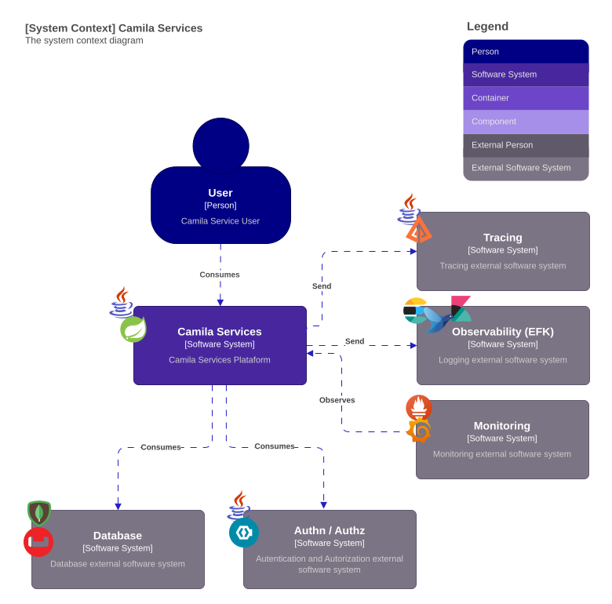

# camila-services

Proyecto de servicios con |Java|Spring|

## Contenido

| Módulo                                        | Descripción                |
|-----------------------------------------------|----------------------------|
| [camila-product-api](/camila-product-api)     | Contiene el API Rest que expone la consulta de productos |
| [camila-discovery](/camila-discovery)         | Contiene un descubridor de servicios |
| [camila-gateway](/camila-gateway)             | Contiene un gateway para servicios |
| [camila-config](/camila-config)               | Contiene un configurador central de servicios |
| [camila-admin](/camila-admin)                 | Contiene un administrador de servicios (UI) |
| [camila-orchestration](/camila-orchestration) | Contiene la configuración como código para orquestar el despliegue del API |

## Diagrama de arquitectura

## Caso de uso

En la plataforma **camila.com**, los productos están organizados en diversas categorías para facilitar la búsqueda de los clientes. Para optimizar la experiencia del usuario, se necesita un algoritmo que ordene los productos dentro de estas categorías. Este algoritmo debe utilizar una combinación ponderada de métricas, como el número de unidades vendidas (representando el 80% del peso) y el ratio de stock (representando el 20% del peso)

Métricas de ejemplo:

- **Ventas por unidades:** número de unidades vendidas.
- **Ratio de stock:** ratio de tallas con stock en ese momento.

El listado de productos es el siguiente:

| id | name                          | sales_units | stock                |
|----|-------------------------------|-------------|----------------------|
| 1  | V-NECH BASIC SHIRT            | 100         | S: 4 / M:9 / L:0     |
| 2  | CONTRASTING FABRIC T-SHIRT    | 50          | S: 35 / M:9 / L:9    |
| 3  | RAISED PRINT T-SHIRT          | 80          | S: 20 / M:2 / L:20   |
| 4  | PLEATED T-SHIRT               | 3           | S: 25 / M:30 / L:10  |
| 5  | CONTRASTING LACE T-SHIRT      | 650         | S: 0 / M:1 / L:0     |
| 6  | SLOGAN T-SHIRT                | 20          | S: 9 / M:2 / L:5     |

El sistema de ordenación estará integrado como un servicio REST, permitiendo la recepción de métricas junto con sus ponderaciones correspondientes. Utilizando esta información, el servicio organizará los productos y proporcionará la lista ordenada
