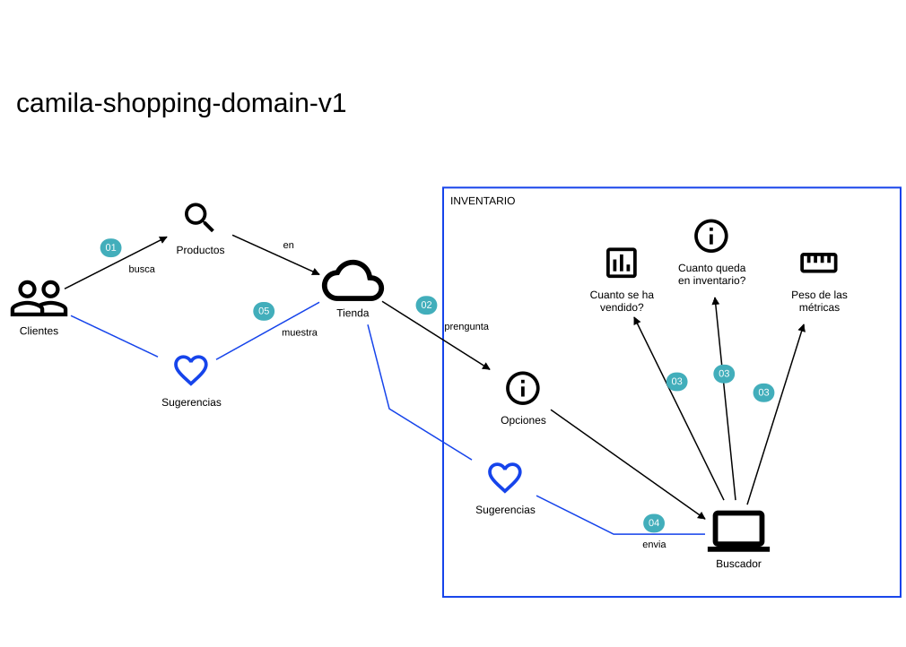
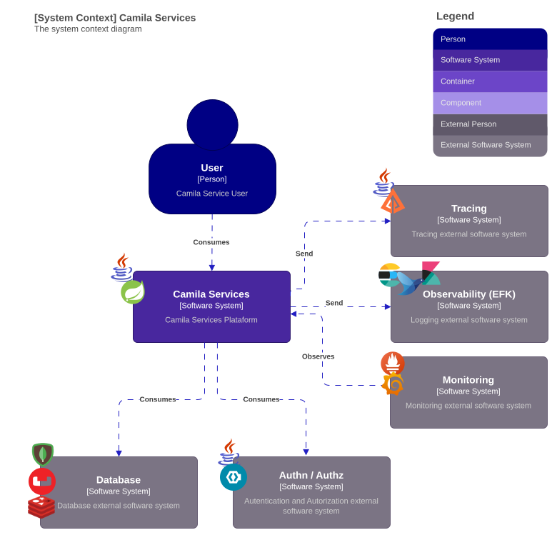
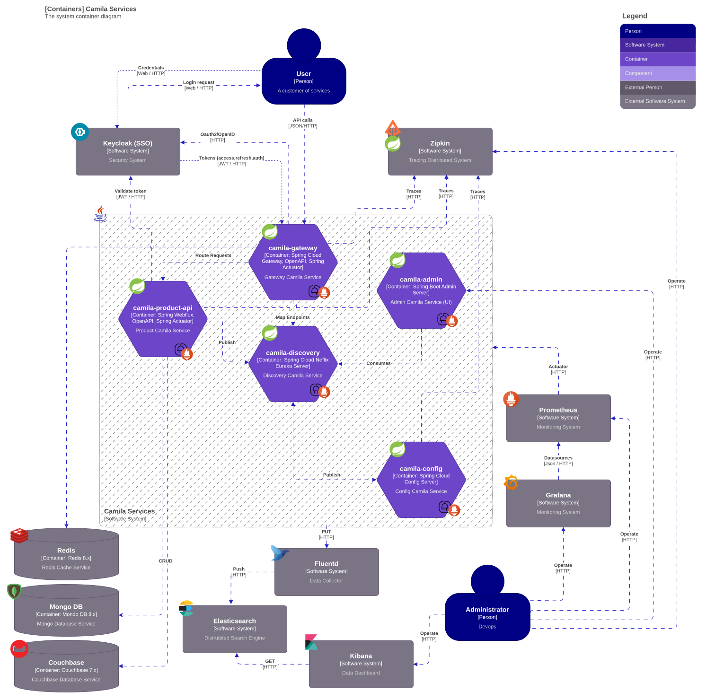

[](https://sonarcloud.io/summary/new_code?id=JuanPabloJimenezEsclusa_camila-services)
[](https://sonarcloud.io/summary/new_code?id=JuanPabloJimenezEsclusa_camila-services)
[](https://sonarcloud.io/summary/new_code?id=JuanPabloJimenezEsclusa_camila-services)
[](https://sonarcloud.io/summary/new_code?id=JuanPabloJimenezEsclusa_camila-services)
[](https://sonarcloud.io/summary/new_code?id=JuanPabloJimenezEsclusa_camila-services)
[](https://sonarcloud.io/summary/new_code?id=JuanPabloJimenezEsclusa_camila-services)
[](https://sonarcloud.io/summary/new_code?id=JuanPabloJimenezEsclusa_camila-services)
[](https://sonarcloud.io/summary/new_code?id=JuanPabloJimenezEsclusa_camila-services)
[](https://sonarcloud.io/summary/new_code?id=JuanPabloJimenezEsclusa_camila-services)
[](https://sonarcloud.io/summary/new_code?id=JuanPabloJimenezEsclusa_camila-services)
[](https://sonarcloud.io/summary/new_code?id=JuanPabloJimenezEsclusa_camila-services)

[](https://github.com/JuanPabloJimenezEsclusa/camila-services/actions/workflows/build-deploy-maven.yml)
[](https://github.com/JuanPabloJimenezEsclusa/camila-services/actions/workflows/code-analysis-pmd.yml)
[](https://github.com/JuanPabloJimenezEsclusa/camila-services/actions/workflows/dependency-review.yml)
[](https://github.com/JuanPabloJimenezEsclusa/camila-services/actions/workflows/docker-publish.yml)
[](https://github.com/JuanPabloJimenezEsclusa/camila-services/actions/workflows/sonarqube.yml)
[](https://github.com/JuanPabloJimenezEsclusa/camila-services/actions/workflows/test-behaviour.yml)
[](https://github.com/JuanPabloJimenezEsclusa/camila-services/actions/workflows/test-mutations.yml)


[](CODE_OF_CONDUCT.md)

<p align="center" style="text-align: center">
  
</p>

<p align="center" style="text-align: center">
  <a href="https://alistair.cockburn.us/hexagonal-architecture/"></a>
  <a href="https://www.reactivemanifesto.org/"></a>
  <a href="https://microservices.io/"></a>
  <a href="https://oauth.net/2/"></a>
  <a href="https://martinfowler.com/articles/serverless.html"></a>
</p>

> [Summary](#-summary)
  • [Disclaimer](#-disclaimer)
  • [Domain Storytelling](#-domain-storytelling) 
  • [Architecture](#-architecture) 
  • [Build and Packing](#-build-and-packing) 
  • [SDLC](#-sdlc)
  • [Changelog](#-changelog) 
  • [Code of Conduct](#-code-of-conduct) 
  • [Contributing](#-contributing) 
  • [License](#-license)

## 📜 Summary

---

The **Camila Services** project is a comprehensive solution that implements a product classification and ranking system for camila.shopping. Using a weighted algorithm that considers metrics like units sold and stock ratio, it optimizes product presentation to enhance customer search experience.

Built with modern technologies, follows best practices for testing and deployment. The project emphasizes code quality through comprehensive testing strategies and automated refactoring to minimize technical debt.

This solution addresses the challenge of effectively organizing diverse product catalogs while providing an improved shopping experience through smarter product presentation.

## ⚠️ Disclaimer

----

> **🔬 Experimental Nature Notice**  
> This project serves as a comprehensive technical laboratory to explore cutting-edge concepts and push technological boundaries.

<details>
<summary><strong>📋 Click to expand detailed explanations</strong></summary>

**🔧 Custom Build Logic (Gradle & Maven):**  
Both build systems are maintained as a technical exercise to compare strengths, weaknesses, and integration patterns in real-world scenarios.

**⚡ Reactive Programming Paradigm:**  
Pervasive use of Project Reactor serves as an experiment to evaluate reactive programming's impact on maintainability and scalability.

**🏗️ Hexagonal Architecture:**  
Strict architectural adherence demonstrates this pattern's benefits and trade-offs across varying project complexity.

**🐳 Buildpack Docker Images:**  
Custom metadata experiments test reproducibility and advanced automation in modern deployment pipelines.

**🔍 Extensive Quality Gates:**  
Multiple analysis tools integration evaluates effectiveness and practical limits of automated quality enforcement.

</details>

> **💡 Note:** These decisions provide transparency for future maintainers understanding the project's experimental nature.

## 🏛️ Domain Storytelling

---

<details>
<summary><strong>Expand Domain Storytelling</strong></summary>

At **camila.shopping**, the need to improve the organization and presentation of products has been recognized. To address this challenge, the development of a classification algorithm that optimizes the user experience when searching for such products has been proposed.



---

**Problem:**
The diversity of products on **camila.shopping** is impressive, but the way they are presented can be improved. The task is to organize these products effectively within their respective categories to make it easier for customers to search.

**Solution:**
The proposed solution is a classification algorithm that uses a weighted combination of metrics, in this case: the number of units sold and the stock ratio. The weighting will assign, for example, 80% weight to the number of units sold. The remaining 20% will be assigned to the stock ratio, these weights being variable in each query.

**Presentation of Results:**
The organized information will be exposed through a REST API. This interface will provide an efficient means to access the list of products sorted according to the defined metrics.

**Implementation:**
The algorithm will be integrated into the **camila.shopping** infrastructure and will communicate with existing systems to collect sales and stock data. Classified information will be available for consumption through an API, providing users with easy and direct access to organized products.

**Expected Impact:**
With this improvement, it is expected to optimize the user experience, increase efficiency in product search and increase customer satisfaction at **camila.shopping**. Implementing the ranking algorithm is a strategic step to stay ahead in the competitive world of e-commerce.

---

Metrics:

| name          | description           |
|---------------|-----------------------|
| Unit sales    | number of units sold  | 
| Stock ratio   | size ratio with stock |
| Profit margin | profit margin         |
| Days in stock | days in stock         |

---

Product data sample:

| id | name                          | sales_units | stock                | profit_margin | days_in_stock |
|----|-------------------------------|-------------|----------------------|---------------|---------------|
| 1  | V-NECH BASIC SHIRT            | 100         | S: 4 / M:9 / L:0     | 0.5           | 30            |
| 2  | CONTRASTING FABRIC T-SHIRT    | 50          | S: 35 / M:9 / L:9    | 0.3           | 150           |
| 3  | RAISED PRINT T-SHIRT          | 80          | S: 20 / M:2 / L:20   | 0.01          | 1             |
| 4  | PLEATED T-SHIRT               | 3           | S: 25 / M:30 / L:10  | 0.12          | 65            |
| 5  | CONTRASTING LACE T-SHIRT      | 650         | S: 0 / M:1 / L:0     | 0.17          | 31            |
| 6  | SLOGAN T-SHIRT                | 20          | S: 9 / M:2 / L:5     | 0.39          | 167           |

</details>

## 🏗️ Architecture

---

<details>
<summary><strong>Expand Architecture & Technologies</strong></summary>

### Technologies

| Development                                                                                                                                                                                                                                                                                                                                                                                                                                                                                                                                                                                                                                                                                                                                                                                                                                                                                                                                                                                                                                                                                                                            | Testing                                                                                                                                                                                                                                                                                                                                                                                                                                                                                                                                                                                                                                                                                                                                                                                                            | Deployment                                                                                                                                                                                                                                                                                                                                                                                                                                                                                                                                                                                                                                                                                                                          |
|----------------------------------------------------------------------------------------------------------------------------------------------------------------------------------------------------------------------------------------------------------------------------------------------------------------------------------------------------------------------------------------------------------------------------------------------------------------------------------------------------------------------------------------------------------------------------------------------------------------------------------------------------------------------------------------------------------------------------------------------------------------------------------------------------------------------------------------------------------------------------------------------------------------------------------------------------------------------------------------------------------------------------------------------------------------------------------------------------------------------------------------|--------------------------------------------------------------------------------------------------------------------------------------------------------------------------------------------------------------------------------------------------------------------------------------------------------------------------------------------------------------------------------------------------------------------------------------------------------------------------------------------------------------------------------------------------------------------------------------------------------------------------------------------------------------------------------------------------------------------------------------------------------------------------------------------------------------------|-------------------------------------------------------------------------------------------------------------------------------------------------------------------------------------------------------------------------------------------------------------------------------------------------------------------------------------------------------------------------------------------------------------------------------------------------------------------------------------------------------------------------------------------------------------------------------------------------------------------------------------------------------------------------------------------------------------------------------------|
| [](https://adoptium.net/es/temurin/releases/) <br/> [](https://www.graalvm.org/downloads/) <br/> [](https://maven.apache.org/) <br/> [](https://gradle.org/releases/) <br/> [](https://spring.io/) <br/> [](https://spring.io/boot) <br/> [](https://spring.io/cloud) <br/> [](https://www.mongodb.com/) <br/> [](https://www.couchbase.com/)<br/> [](https://redis.io/open-source/) | [](https://junit.org/junit5/) <br/> [](https://cucumber.io/) <br/> [](https://pitest.org/) <br/> [](https://codecentric.github.io/chaos-monkey-spring-boot/) <br/> [](https://www.archunit.org/) <br/> [](https://jmeter.apache.org/) <br/> [](https://testcontainers.com/) | [](https://www.docker.com/) <br/> [](https://kubernetes.io/releases/) <br/> [](https://github.com/knative/serving/releases/) <br/> [](https://aws.amazon.com/es/cli/) <br/> [](https://aws.amazon.com/es/cli/) |

### Components

| Component                                   | Description                                                      |
|---------------------------------------------|------------------------------------------------------------------|
| [camila-product-api](/camila-product-api)   | Contains a microservice that exposes the product query           |
| [camila-gateway](/camila-gateway)           | Contains a gateway for services                                  |
| [camila-admin](/camila-admin)               | Contains a services manager (UI)                                 |
| [camila-orchestrator](/camila-orchestrator) | Contains configuration as code to orchestrate project deployment |
| [camila-performance](/camila-performance)   | Contains performance tests of the projects                       |

### Diagrams





</details>

## 📦 Build and Packing

---

<details>
<summary><strong>Expand Build and Packing</strong></summary>

### Build

```bash
# Maven
export NVD_API_KEY="${NVD_API_KEY:-}"
# Standard build with all quality checks
mvn --no-transfer-progress --also-make -B clean verify -P error-prone,quality-check -Dgpg.skip -DnvdApiKey=${NVD_API_KEY} \
  | tee mvn-clean-verify-$(date +%Y%m%d-%H%M%S).log
# Build without tests (faster)
mvn clean package -DskipTests=true -am
# Build with mutation testing
mvn clean verify -P pitest -am
```

```bash
# Gradle
# Standard build
gradle clean build --rerun-tasks --console=plain | tee gradle-clean-build-$(date +%Y%m%d-%H%M%S).log
# Unit tests only
gradle unitTest
# Full quality checks with strict compilation
gradle qualityBuild -PerrorProne -PqualityCheck
# With mutation testing
gradle mutationTest -Ppitest
# Build without tests (faster)
gradle clean build -x test
```

### Refactoring

> Using [OpenRewrite](https://docs.openrewrite.org/) to automatize some common refactoring to reduce technical debts

```bash
# Maven
mvn rewrite:runNoFork -Popen-rewrite -am | tee mvn-rewrite-$(date +%Y%m%d-%H%M%S).log
```

```bash
# Gradle - Preview changes (dry run)
gradle codeRewritePreview | tee gradle-rewrite-preview-$(date +%Y%m%d-%H%M%S).log
# Gradle - Apply changes
gradle codeRewrite | tee gradle-rewrite-apply-$(date +%Y%m%d-%H%M%S).log
```

### Dependency Updates

```bash
# Maven
mvn versions:display-dependency-updates
mvn versions:display-plugin-updates
mvn versions:display-property-updates
mvn --no-transfer-progress -B com.giovds:outdated-maven-plugin:check -Dyears=2 -DincludePlugins=true
```

```bash
# Gradle
gradle displayDependencyUpdates
gradle displayPluginUpdates
```

### Packing

```bash
export SPRING_PROFILES_ACTIVE="${SPRING_PROFILES_ACTIVE:-"loc"}"
export MAVEN_GPG_PASSPHRASE="${MAVEN_GPG_PASSPHRASE:-"password"}"

# Maven - Jars
# Deploy packages into github repository,
# if there is a "github" server configuration in "settings.xml"  
mvn --no-transfer-progress --also-make deploy \
  -Dmaven.build.cache.enabled=false \
  -Dmaven.test.skip=true  -f ./pom.xml | tee mvn-deploy-$(date +%Y%m%d-%H%M%S).log

# Maven - Images
mvn --no-transfer-progress --also-make spring-boot:build-image \
  -Dmaven.build.cache.enabled=false \
  -Dmaven.test.skip=true  -f ./pom.xml | tee mvn-build-image-$(date +%Y%m%d-%H%M%S).log
```

```bash
# Gradle - Jars
# Assemble packages to configured repositories
gradle assemble -x test \
  --console=plain | tee gradle-assemble-$(date +%Y%m%d-%H%M%S).log

# Gradle - Docker Images using Spring Boot
gradle bootBuildImage -x test \
  --console=plain | tee gradle-build-image-$(date +%Y%m%d-%H%M%S).log

# Gradle - Docker Images using Jib (requires -Pjib flag)
gradle jibDockerBuild -Pjib -x test \
  --console=plain | tee gradle-jib-build-$(date +%Y%m%d-%H%M%S).log
```

### Code Analysis Report

```bash
# Unset Spring Profile
unset SPRING_PROFILES_ACTIVE
export NVD_API_KEY="${NVD_API_KEY:-}"
# Verify project with quality gates
mvn --no-transfer-progress -B install site -P error-prone,quality-check -Dgpg.skip -DnvdApiKey=${NVD_API_KEY} \
  | tee mvn-install-site-$(date +%Y%m%d-%H%M%S).log
# Consolidate reports
mvn --no-transfer-progress -B site:stage-deploy
# Open report
xdg-open ./target/report/camila-services/staging/index.html
```

```bash
# Gradle - Complete quality analysis with all checks
gradle clean qualityBuild -PerrorProne -PqualityCheck \
  --console=plain | tee gradle-quality-build-$(date +%Y%m%d-%H%M%S).log

# Checkstyle
gradle checkstyleMain checkstyleTest --console=plain
# SpotBugs (requires quality-check in product-api)
gradle :camila-product-api:spotbugsMain --console=plain
# JaCoCo Coverage
gradle test jacocoTestReport --console=plain
# OWASP Dependency Check
gradle :camila-product-api:dependencyCheckAnalyze --console=plain
# SonarQube Analysis (requires SONAR_TOKEN)
export SONAR_TOKEN="your-sonar-token"
gradle sonar -Psonar.token=${SONAR_TOKEN} --console=plain
```

### Maven vs Gradle Command Reference

| Task | Maven Command | Gradle Command | Status |
|------|---------------|----------------|--------|
| **Clean Build** | `mvn clean verify` | `gradle clean build` | ✅ Parity |
| **Build with Quality Checks** | `mvn clean verify -P error-prone,quality-check` | `gradle qualityBuild -PerrorProne -PqualityCheck` | ✅ Parity |
| **Run Tests** | `mvn test` | `gradle test` | ✅ Parity |
| **Run Unit Tests Only** | `mvn test -Dtest=*Test` | `gradle unitTest` | ✅ Parity |
| **Run Integration Tests** | `mvn verify` | `gradle integrationTest` | ✅ Parity |
| **Skip Tests** | `mvn install -DskipTests` | `gradle build -x test` | ✅ Parity |
| **Code Coverage** | `mvn jacoco:report` | `gradle jacocoTestReport` | ✅ Parity |
| **Coverage Aggregation** | `mvn jacoco:report` (all modules) | `gradle aggregateJacoco` | ✅ Parity |
| **Checkstyle** | `mvn checkstyle:check` | `gradle checkstyleMain checkstyleTest` | ✅ Parity |
| **PMD** | `mvn pmd:check` | N/A | Maven only |
| **SpotBugs** | `mvn spotbugs:check` | `gradle spotbugsReport` | ✅ **Parity (Phase 2.3)** |
| **Error Prone** | `mvn verify -P error-prone` | `gradle build -PerrorProne` | ✅ **Parity (Phase 2.1)** |
| **Mutation Testing** | `mvn pitest:mutationCoverage -Ppitest` | `gradle mutationTest -Ppitest` | ✅ **Parity (Phase 2.2)** |
| **OWASP Security Check** | `mvn dependency-check:check` | `gradle dependencyCheckAnalyze` | ✅ Parity |
| **Dependency Updates** | `mvn versions:display-dependency-updates` | `gradle displayDependencyUpdates` | ✅ Parity |
| **Plugin Updates** | `mvn versions:display-plugin-updates` | `gradle displayPluginUpdates` | ✅ Parity |
| **SonarQube** | `mvn sonar:sonar` | `gradle sonar` | ✅ Parity |
| **OpenRewrite Preview** | `mvn rewrite:dryRun -Popen-rewrite` | `gradle codeRewritePreview` | ✅ **Parity (Phase 2.4)** |
| **OpenRewrite Apply** | `mvn rewrite:run -Popen-rewrite` | `gradle codeRewrite` | ✅ **Parity (Phase 2.4)** |
| **Install to Local** | `mvn install` | `gradle publishToMavenLocal` | ✅ Parity |
| **Deploy/Publish** | `mvn deploy` | `gradle publish` | ✅ Parity |
| **Build Docker Image** | `mvn spring-boot:build-image` | `gradle bootBuildImage` | ✅ Parity |
| **Jib Docker Build** | `mvn jib:dockerBuild -Pjib` | `gradle jibDockerBuild -Pjib` | ✅ Parity |
| **Generate Site** | `mvn site` | N/A (use individual reports) | Maven only |
| **Generate Changelog** | `mvn generate-sources` | N/A (manual Git commands) | Manual |
| **Show Dependencies** | `mvn dependency:tree` | `gradle dependencies` | ✅ Parity |

### Profile/Property Equivalents

| Maven Profile/Property | Gradle Property/Flag | Purpose |
|------------------------|----------------------|---------|
| `-P error-prone` | `-PerrorProne` | Strict compile-time error checking (Phase 2.1) |
| `-P quality-check` | `-PqualityCheck` | Enable all quality analysis tools |
| `-P pitest` | `-Ppitest` | Enable mutation testing (Phase 2.2) |
| `-P open-rewrite` | (built-in) | Enable code refactoring recipes (Phase 2.4) |
| `-P native` | `-Pnative` | Build native image with GraalVM |
| `-P jib` | `-Pjib` | Build Docker image with Jib tool |

### Command Line Option Equivalents

| Maven Option | Gradle Option | Purpose |
|--------------|---------------|---------|
| `-B` (batch mode) | `--console=plain` | Non-interactive output |
| `-X` (debug) | `--debug` | Debug logging |
| `-q` (quiet) | `--quiet` | Quiet mode |
| `-D maven.test.skip=true` | `-x test` | Skip tests |
| `-D skipTests=true` | `-x test` | Skip tests |
| `--offline` | `--offline` | Offline mode |
| `-pl <module>` | `-p <module>` | Build specific module |

</details>

## ⚙️ SDLC

---

<details>
<summary><strong>Expand SDLC</strong></summary>

This project follows a lightweight SDLC (Software Development Life Cycle) to ensure features are planned, implemented, tested, released and monitored consistently.

- Plan: capture requirements as issues and design decisions in the `.docs/architecture/` folder and in GitHub issues/PR descriptions.
- Code: follow the contribution guidelines in `CONTRIBUTING.md` (branch-per-feature, small PRs, descriptive commit messages).
- Build: CI runs via GitHub Actions (see `.github/workflows/` — e.g. build & deploy badges at the top of this README).
- Test: unit, integration, mutation and behavior tests are defined (see `camila-product-api/src/test/Readme.md` and the tests folders). Run tests locally before creating a PR.
- Release: artifacts are built with Maven and published from CI (see the build/deploy workflow badge above).
- Deploy / Operate: orchestrations and deployment scripts live under `camila-orchestrator` and `.operate/` (see their READMEs).
- Feedback & Improve: use issue tracker, code analysis reports, and CI feedback to iterate.

Helpful links:

- CONTRIBUTING: `CONTRIBUTING.md`
- Tests & QA: `camila-product-api/src/test/Readme.md`
- Operations / Deploy: `.operate/Readme.md` and `camila-orchestrator/Readme.md`
- Architecture: `.docs/architecture/`

</details>

## 📋 Changelog

---

<details>
<summary><strong>Expand Changelog</strong></summary>

See [CHANGELOG.md](CHANGELOG.md) for details on version history and changes.

To update, run the following command:

```bash
mvn generate-sources
```

</details>

## 🤝 Code of Conduct

---

This project follows the [Contributor Covenant](CODE_OF_CONDUCT.md) Code of Conduct. By participating, you are expected to uphold this code.

## 👥 Contributing

---

We welcome contributions of all kinds! See [CONTRIBUTING.md](CONTRIBUTING.md) for ways to get started and our development process.

## ⚖️ License

---

This project is licensed under the [GNU General Public License](LICENSE.md) - see the file for details.
