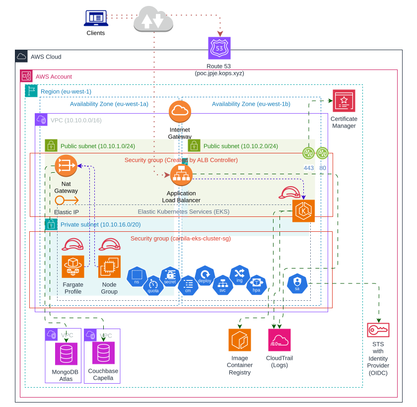

# camila-product-orchestrator-int (k8s) (AWS)

> [Summary](#-summary)
  • [Dependencies](#-dependencies)
  • [Architecture](#-architecture)
  • [Usage](#-usage)
  • [Testing](#-testing)
  • [Links](#-links)

## 📜 Summary

---

Based on `AWS Cloud Provider`, specifically [EKS](https://aws.amazon.com/es/eks/)

> It is recommended to use dark mode UI to read this!

## ⚙️ Dependencies

---

* Docker ~= 27.3.0
* AWS CLI >= 2.15.52

## 🏗️ Architecture

---

<p style="text-align: center">

  <h4>With AWS Cloud Formation</h4>
  Deployment on Elastic Kubernetes Service (EKS).

  
  

</p>

## 🌐 Usage

---

❗ This infrastructure incurs costs. Avoid keeping it running if it's not in use.

### _AWS Cloud formation_

| File                                                                            | Description                                                            |
|---------------------------------------------------------------------------------|------------------------------------------------------------------------|
| [templates/eks.yml](cloudformation/templates/eks.yml)                           | Infrastructure template for deploying EKS cluster on AWS               |
| [API/camila-product-api.yml](cloudformation/API/camila-product-api.yml)         | Script with K8S objects                                                |
| [eks-stack-init.sh](cloudformation/eks-stack-init.sh)                           | Script to deploy the cluster via AWS CLI                               |
| [eks-stack-delete.sh](cloudformation/eks-stack-delete.sh)                       | Script to delete the cluster using AWS CLI                             |
| [eks-install-alb-controller.sh](cloudformation/eks-install-alb-controller.sh)   | Script to install ALB controller addons to let K8S create loadbalancer |
| [eks-api-apply.sh](cloudformation/eks-api-apply.sh)                             | Script to apply infrastructure using AWS CLI                           |
| [eks-api-delete.sh](cloudformation/eks-api-delete.sh)                           | Script to delete infrastructure using AWS CLI                          |

---

> The databases are configured as SaaS (Mongo Atlas and Couchbase Capella)

```bash
# Init EKS cluster stack 
./eks-stack-init.sh

# Install ALB controller
./eks-install-alb-controller.sh

# Init containers infrastructure
export COUCHBASE_CONNECTION="couchbases://cb.****.cloud.couchbase.com"
export COUCHBASE_USERNAME="juanpablo****"
export COUCHBASE_PASSWORD="*************"
export MONGO_URI="mongodb+srv://****:****@****.****.mongodb.net/camila-db?ssl=true&retryWrites=true&w=majority&maxPoolSize=200&connectTimeoutMS=5000&socketTimeoutMS=120000"
./eks-api-apply.sh
```

```bash
# Delete containers infrastructure
./eks-api-delete.sh

# Delete EKS cluster service
./eks-stack-delete.sh
```

---

## 🧪 Testing

---

| File                                               | Description                                                 |
|----------------------------------------------------|-------------------------------------------------------------|
| [tests/api-requests.http](tests/api-requests.http) | API request tests (REST, GraphQL, Websocket, RSocket, GRPC) |

<p style="text-align: center">
  
  
</p>

## 🔗 Links

---

* API
  * [API Rest (Swagger-ui)](https://poc.jpje-kops.xyz/product-int/api/webjars/swagger-ui/index.html#/)

* AWS UI
  * [AWS CloudFormation](https://eu-west-1.console.aws.amazon.com/cloudformation/home?region=eu-west-1#/stacks?filteringText=&filteringStatus=active&viewNested=true)
  * [AWS EKS Cluster](https://eu-west-1.console.aws.amazon.com/eks/home?region=eu-west-1#/clusters) 💰💰
  * [AWS Certificate Manager (ACM)](https://eu-west-1.console.aws.amazon.com/acm/home?region=eu-west-1#/certificates/list)
  * [AWS VPC](https://eu-west-1.console.aws.amazon.com/vpcconsole/home?region=eu-west-1#vpcs) 💰
  * [AWS ECR](https://eu-west-1.console.aws.amazon.com/ecr/repositories/private/546053716955/camila-product-api?region=eu-west-1)
  * [AWS EC2 Load Balancer](https://eu-west-1.console.aws.amazon.com/ec2/home?region=eu-west-1#LoadBalancers) 💰
  * [AWS EC2 Instances](https://eu-west-1.console.aws.amazon.com/ec2/home?region=eu-west-1#Instances) 💰
  * [AWS CloudWatch](https://eu-west-1.console.aws.amazon.com/cloudwatch/home?region=eu-west-1#logsV2:log-groups)
  * [Elastic IP](https://eu-west-1.console.aws.amazon.com/vpcconsole/home?region=eu-west-1#Addresses) 💰💰
  * [AWS NAT Gateway](https://eu-west-1.console.aws.amazon.com/vpcconsole/home?region=eu-west-1#NatGateways) 💰💰💰

* Databases
  * [Mongo Atlas](https://cloud.mongodb.com/v2/665f45371f34d90e0237aca0#/overview) (free tier)
  * [Couchbase Capella](https://cloud.couchbase.com/databases?oid=6436d8a0-3909-4aea-8ff7-1673510b6c11) (free tier)
