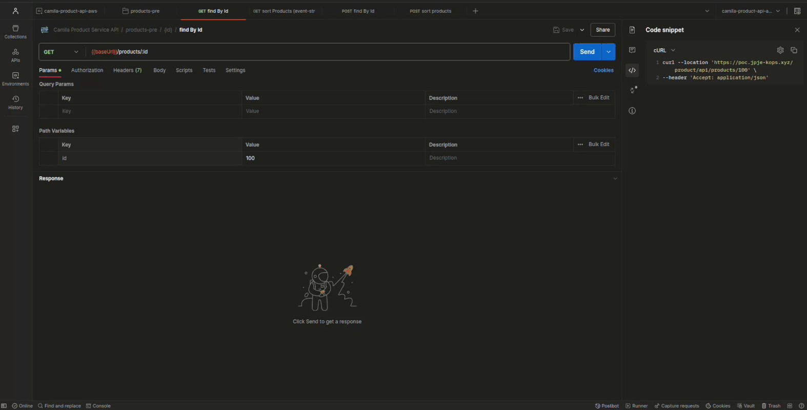
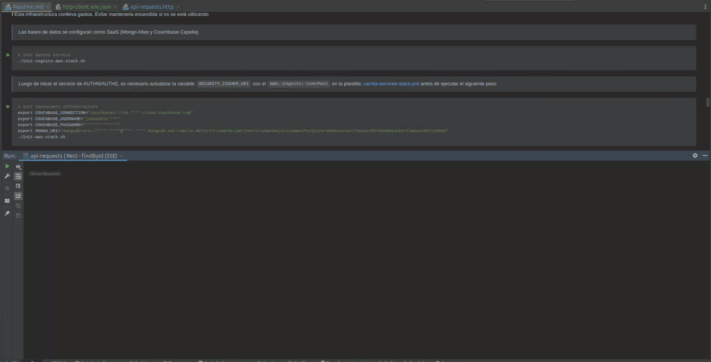

# camila-product-orchestrator-pre

Basado en `AWS Provider`

## Pre-condiciones

* Docker >= 24.0.6
* AWS CLI >= 2.15.52
* JQ >= 1.7

## Arquitectura

<p style="text-align: center">
  
  
</p>

## Operaciones

| Archivo                                                                                | Descripción                                                                              |
|----------------------------------------------------------------------------------------|------------------------------------------------------------------------------------------|
| [templates/camila-cognito-oauth2-stack](aws/templates/camila-cognito-oauth2-stack.yml) | Plantilla de infraestructura de despliegue de Oauth2 service en AWS                      |
| [templates/camila-services-stack](aws/templates/camila-services-stack.yml)             | Plantilla de infraestructura de despliegue de contenedores en AWS                        |
| [init-cognito-aws-stack](./aws/init-cognito-aws-stack.sh)                              | Script para desplegar el servicio Oauth2 a partir de una plantilla de AWS CloudFormation |
| [delete-cognito-aws-stack](./aws/delete-cognito-aws-stack.sh)                          | Script para eliminar el servicio Oauth2 utilizando AWS CLI                               |
| [init-aws-stack](./aws/init-aws-stack.sh)                                              | Script para desplegar la infraestructura a partir de una plantilla de AWS CloudFormation |
| [delete-aws-stack](./aws/delete-aws-stack.sh)                                          | Script para eliminar la infraestructura utilizando AWS CLI                               |
| [tests/api-requests](aws/tests/api-requests.http)                                      | Pruebas de peticiones al API (REST, Graphql, Websocket y RSocket)                        |
| [tests/http-client.env](aws/tests/http-client.env.json)                                | Configuraciones de seguridad para las pruebas                                            |
| [tests/cli-curl-tests](aws/tests/cli-curl-tests.sh)                                    | Pruebas de Oauth2 via CLI                                                                |

---

❗ Esta infraestructura conlleva gastos. Evitar mantenerla encendida si no se está utilizando

> Las bases de datos se configuran como SaaS (Mongo Atlas y Couchbase Capella)

```bash
# Init Oauth2 service
./init-cognito-aws-stack.sh
```

> Luego de inicar el servicio de AUTHN/AUTHZ, es necesario actualizar la variable `SECURITY_ISSUER_URI` con el `AWS::Cognito::UserPool` en la plantilla: [camila-services-stack.yml](./templates/camila-services-stack.yml) antes de ejecutar el siguiente paso

```bash
# Init containers infrastructure
export COUCHBASE_CONNECTION="couchbases://cb.****.cloud.couchbase.com"
export COUCHBASE_USERNAME="juanpablo****"
export COUCHBASE_PASSWORD="*************"
export MONGO_URI="mongodb+srv://****:****@****.****.mongodb.net/camila-db?ssl=true&retryWrites=true&w=majority&maxPoolSize=200&connectTimeoutMS=5000&socketTimeoutMS=120000"
./init-aws-stack.sh
```

```bash
# Delete containers infrastructure
./delete-aws-stack.sh
```

```bash
# Delete Oauth2 service
./delete-cognito-aws-stack.sh
```

> Es posible iniciar un contenedor locamente con la imagen del registro de imágenes de AWS para comprobar, entre otros, las variables de entorno y la comunicaión TLS con las BBDD

```bash
# Local image test
docker run --rm -it \
  --name="camila-product-api" \
  --network=host \
  --env SPRING_PROFILES_ACTIVE=PRE \
  --env LANG=en_US.utf8 \
  --env LANGUAGE=en_US.utf8 \
  --env LC_ALL=en_US.utf8 \
  --env spring.data.mongodb.uri="mongodb+srv://****:****@****.****.mongodb.net/camila-db" \
  --env spring.data.mongodb.ssl.enabled="false" \
  --env spring.couchbase.connection-string="couchbases://cb.****.cloud.couchbase.com" \
  --env spring.couchbase.username="juanpablo****" \
  --env spring.couchbase.password="*************" \
  --env spring.couchbase.env.ssl.enabled=true \
  --env spring.application.repository.technology="mongo" \
  --memory="1024m" --memory-reservation="1024m" --memory-swap="1024m" --cpu-shares=500 \
  546053716955.dkr.ecr.eu-west-1.amazonaws.com/camila-product-api:1.0.0
```

---

### Pruebas

<p style="text-align: center">
  
  
  
</p>

## Enlaces

* API
  * [API Rest (Swagger-ui)](https://poc.jpje-kops.xyz/product/api/webjars/swagger-ui/index.html#/)

* AWS UI
  * [AWS Cognito (User Pool)](https://eu-west-1.console.aws.amazon.com/cognito/v2/idp/user-pools?region=eu-west-1) 💰
  * [AWS CloudFormation](https://eu-west-1.console.aws.amazon.com/cloudformation/home?region=eu-west-1#/stacks?filteringText=&filteringStatus=active&viewNested=true)
  * [AWS ECS Cluster](https://eu-west-1.console.aws.amazon.com/ecs/v2/clusters/camila-product-cluster/services/camila-product-service/health?region=eu-west-1) 💰
  * [AWS Certificate Manager (ACM)](https://eu-west-1.console.aws.amazon.com/acm/home?region=eu-west-1#/certificates/list)
  * [AWS VPC](https://eu-west-1.console.aws.amazon.com/vpcconsole/home?region=eu-west-1#vpcs:)
  * [AWS ECR](https://eu-west-1.console.aws.amazon.com/ecr/repositories/private/546053716955/camila-product-api?region=eu-west-1)
  * [AWS EC2 Load Balancer](https://eu-west-1.console.aws.amazon.com/ec2/home?region=eu-west-1#LoadBalancers:) 💰
  * [AWS CloudWatch](https://eu-west-1.console.aws.amazon.com/cloudwatch/home?region=eu-west-1#logsV2:log-groups)
  * [AWS Secret Manager](https://eu-west-1.console.aws.amazon.com/secretsmanager/listsecrets?region=eu-west-1) 💰

* Databases
  * [Mongo Atlas](https://cloud.mongodb.com/v2/665f45371f34d90e0237aca0#/overview)
  * [Couchbase Capella](https://cloud.couchbase.com/databases?oid=6436d8a0-3909-4aea-8ff7-1673510b6c11) 💰 (only 30+ days free tier)
