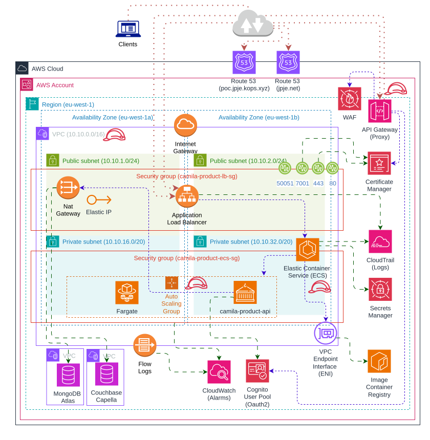

# camila-product-orchestrator-pre (AWS)

Based on `AWS Cloud Provider`

> It is recommended to use dark mode UI to read this!

## Prerequisites

* Docker ~= 27.3.0
* AWS CLI >= 2.15.52
* JQ >= 1.7
* Terraform >= 1.9.8

## Architecture

<p style="text-align: center">

  <h4>With AWS Cloud Formation</h4>
  Basic deployment prioritizing simplification of the architecture and leveraging the AWS free tier. Designed as a development environment.

  
  

  <h4>With Terraform</h4>
  Deployment covering some advanced architectural options. Contains AWS components that do not have a free tier. The following elements are incorporated:

  1. VPC Endpoint, to enable communication between the container service (ECS) and the image registry (ECR) without requiring a public IP.
  2. NAT Gateway, to allow outbound communication with databases located in another virtual network, while keeping containers in a private subnet without public IPs.
  3. API Gateway, to create a proxy that centralizes certain configurations such as: AUTHZ/AUTHN, quota limits, etc.

  
  Docs: <a href="https://docs.aws.amazon.com/whitepapers/latest/microservices-on-aws/microservices-on-serverless-technologies.html">AWS microservices-on-serverless-technologies</a>

</p>

## Operations

❗ This infrastructure incurs costs. Avoid keeping it running if it's not in use.

### _AWS Cloud formation_

| File                                                                                                  | Description                                                         |
|-------------------------------------------------------------------------------------------------------|---------------------------------------------------------------------|
| [templates/camila-cognito-oauth2-stack.yml](cloudformation/templates/camila-cognito-oauth2-stack.yml) | Infrastructure template for deploying Oauth2 service on AWS         |
| [templates/camila-secrets-stack.yml](cloudformation/templates/camila-secrets-stack.yml)               | Infrastructure template for deploying secrets on AWS                |
| [templates/camila-services-stack.yml](cloudformation/templates/camila-services-stack.yml)             | Infrastructure template for deploying containers on AWS             |
| [init-cognito-aws-stack.sh](cloudformation/init-cognito-aws-stack.sh)                                 | Script to deploy Oauth2 service from an AWS CloudFormation template |
| [delete-cognito-aws-stack.sh](cloudformation/delete-cognito-aws-stack.sh)                             | Script to delete Oauth2 service using AWS CLI                       |
| [init-aws-stack.sh](cloudformation/init-aws-stack.sh)                                                 | Script to deploy infrastructure from an AWS CloudFormation template |
| [delete-aws-stack.sh](cloudformation/delete-aws-stack.sh)                                             | Script to delete infrastructure using AWS CLI                       |

---

> The databases are configured as SaaS (Mongo Atlas and Couchbase Capella)

```bash
# Init Oauth2 service
./cloudformation/init-cognito-aws-stack.sh

# Init containers infrastructure
export COUCHBASE_CONNECTION="couchbases://cb.****.cloud.couchbase.com"
export COUCHBASE_USERNAME="juanpablo****"
export COUCHBASE_PASSWORD="*************"
export MONGO_URI="mongodb+srv://****:****@****.****.mongodb.net/camila-db?ssl=true&retryWrites=true&w=majority&maxPoolSize=200&connectTimeoutMS=5000&socketTimeoutMS=120000"
./cloudformation/init-aws-stack.sh
```

```bash
# Delete containers infrastructure
./cloudformation/delete-aws-stack.sh

# Delete Oauth2 service
./cloudformation/delete-cognito-aws-stack.sh
```

---

### _Terraform_

| File                                                                                                               | Description                                                            |
|--------------------------------------------------------------------------------------------------------------------|------------------------------------------------------------------------|
| [templates/main.tf](terraform/templates/main.tf)                                                                   | Base Terraform template                                                |
| [templates/modules/cognito/camila-cognito-oauth2.tf](terraform/templates/modules/cognito/camila-cognito-oauth2.tf) | Infrastructure deployment template for an Oauth2 service in AWS        |
| [templates/modules/ecs/camila-ecs-container.tf](terraform/templates/modules/ecs/camila-ecs-container.tf)           | Infrastructure deployment template for container deployments in AWS    |
| [templates/modules/gateway/camila-gateway.tf](terraform/templates/modules/gateway/camila-gateway.tf)               | Infrastructure deployment template for gateway service in AWS          |
| [templates/modules/gateway/camila-waf.tf](terraform/templates/modules/waf/camila-waf.tf)                           | Infrastructure deployment template for Web Application Firewall in AWS |
| [init-aws-plan.sh](terraform/init-aws-plan.sh)                                                                     | Script to initialize Terraform and validate the templates              |
| [apply-aws-plan.sh](terraform/apply-aws-plan.sh)                                                                   | Script to deploy the infrastructure using Terraform                    |
| [destroy-aws-plan.sh](terraform/destroy-aws-plan.sh)                                                               | Script to destroy the infrastructure using Terraform CLI               |

```bash
# Init and validate plan
export COUCHBASE_CONNECTION="couchbases://cb.****.cloud.couchbase.com"
export COUCHBASE_USERNAME="juanpablo****"
export COUCHBASE_PASSWORD="*************"
export MONGO_URI="mongodb+srv://****:****@****.****.mongodb.net/camila-db?ssl=true&retryWrites=true&w=majority&maxPoolSize=200&connectTimeoutMS=5000&socketTimeoutMS=120000"
./terraform/init-aws-plan.sh

# Apply plan
./terraform/apply-aws-plan.sh
```

```bash
# Destroy plan
./terraform/destroy-aws-plan.sh
```

---

### Tests

| File                                                                                     | Description                                                 |
|------------------------------------------------------------------------------------------|-------------------------------------------------------------|
| [tests/api-requests.http](tests/api-requests.http)                                       | API request tests (REST, GraphQL, Websocket, RSocket, GRPC) |
| [tests/http-client.env.json](tests/http-client.env.json)                                 | Security configurations for the tests                       |
| [tests/cli-curl-client-credentials-tests.sh](tests/cli-curl-client-credentials-tests.sh) | Oauth2 (grant type: client credentials) tests via CLI       |
| [tests/cli-curl-code_authorization-tests.sh](tests/cli-curl-code_authorization-tests.sh) | Oauth2 (grant type: code authorization) tests via CLI       |

<p style="text-align: center">
  
  
  
</p>

> Running a container locally using the image from the AWS ECR (Elastic Container Registry) is feasible for verifying environment variables, TLS communication with databases, and other aspects.

```bash
# Local image test
docker run --rm -it \
  --name="camila-product-api" \
  --network=host \
  --env SPRING_PROFILES_ACTIVE=PRE \
  --env LANG=en_US.utf8 \
  --env LANGUAGE=en_US.utf8 \
  --env LC_ALL=en_US.utf8 \
  --env spring.data.mongodb.uri="mongodb+srv://****:****@****.****.mongodb.net/camila-db" \
  --env spring.data.mongodb.ssl.enabled="true" \
  --env spring.couchbase.connection-string="couchbases://cb.****.cloud.couchbase.com" \
  --env spring.couchbase.username="juanpablo****" \
  --env spring.couchbase.password="*************" \
  --env spring.couchbase.env.ssl.enabled=true \
  --env spring.application.repository.technology="mongo" \
  --memory="1024m" --memory-reservation="1024m" --memory-swap="1024m" --cpu-shares=500 \
  546053716955.dkr.ecr.eu-west-1.amazonaws.com/camila-product-api:1.0.0
```

## Links

* API
  * [API Rest (Swagger-ui)](https://poc.jpje-kops.xyz/product/api/webjars/swagger-ui/index.html#/)

* AWS UI
  * [AWS Cognito (User Pool)](https://eu-west-1.console.aws.amazon.com/cognito/v2/idp/user-pools?region=eu-west-1) 💰
  * [AWS CloudFormation](https://eu-west-1.console.aws.amazon.com/cloudformation/home?region=eu-west-1#/stacks?filteringText=&filteringStatus=active&viewNested=true)
  * [AWS ECS Cluster](https://eu-west-1.console.aws.amazon.com/ecs/v2/clusters/camila-product-cluster/services/camila-product-service/health?region=eu-west-1) 💰
  * [AWS Certificate Manager (ACM)](https://eu-west-1.console.aws.amazon.com/acm/home?region=eu-west-1#/certificates/list)
  * [AWS VPC](https://eu-west-1.console.aws.amazon.com/vpcconsole/home?region=eu-west-1#vpcs) 💰
  * [AWS ECR](https://eu-west-1.console.aws.amazon.com/ecr/repositories/private/546053716955/camila-product-api?region=eu-west-1)
  * [AWS EC2 Load Balancer](https://eu-west-1.console.aws.amazon.com/ec2/home?region=eu-west-1#LoadBalancers) 💰
  * [AWS CloudWatch](https://eu-west-1.console.aws.amazon.com/cloudwatch/home?region=eu-west-1#logsV2:log-groups)
  * [AWS Secret Manager](https://eu-west-1.console.aws.amazon.com/secretsmanager/listsecrets?region=eu-west-1) 💰
  * [AWS VPC Endpoint](https://eu-west-1.console.aws.amazon.com/vpcconsole/home?region=eu-west-1#Endpoints) 💰💰
  * [Elastic IP](https://eu-west-1.console.aws.amazon.com/vpcconsole/home?region=eu-west-1#Addresses) 💰💰
  * [AWS NAT Gateway](https://eu-west-1.console.aws.amazon.com/vpcconsole/home?region=eu-west-1#NatGateways) 💰💰💰
  * [AWS API Gateway](https://eu-west-1.console.aws.amazon.com/apigateway/main/apis?region=eu-west-1) 💰💰💰
  * [AWS WAF](https://us-east-1.console.aws.amazon.com/wafv2/homev2/web-acls?region=eu-west-1) 💰

* Databases
  * [Mongo Atlas](https://cloud.mongodb.com/v2/665f45371f34d90e0237aca0#/overview) (free tier)
  * [Couchbase Capella](https://cloud.couchbase.com/databases?oid=6436d8a0-3909-4aea-8ff7-1673510b6c11) (free tier)
