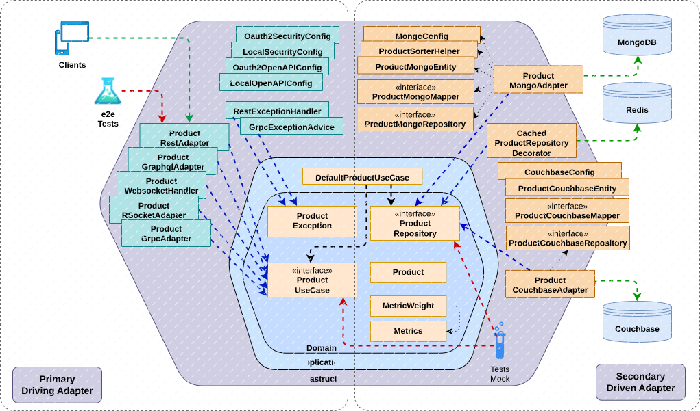
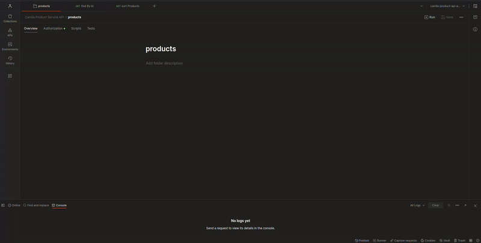
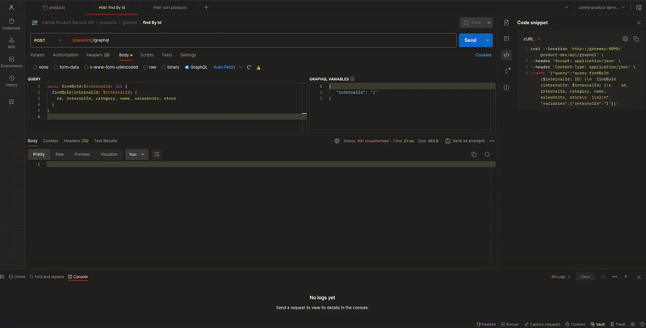
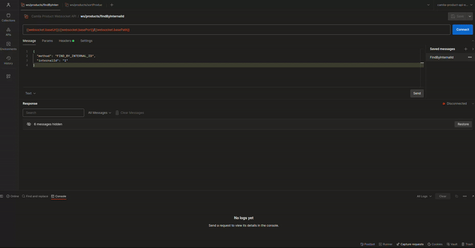

# camila-product-api

> [Summary](#-summary)
  • [Dependencies](#-dependencies)
  • [API-First Approach](#-api-first-approach)
  • [Architecture](#-architecture)
  • [Links](#-links)
  • [Usage](#-usage)
  • [Testing](#-testing)
  • [Operations](#-operations)
  • [Notes](#-notes)

## 📜 Summary

---

Microservice example. Implements a product API with the following features:

- Design: [API First Approach](https://www.postman.com/api-first/), [Domain Driven Design](https://en.wikipedia.org/wiki/Domain-driven_design)
- Paradigm: [Reactive](https://projectreactor.io/learn)
- Architecture: [Hexagonal](https://alistair.cockburn.us/hexagonal-architecture/)
- Communication: [Rest](https://en.wikipedia.org/wiki/REST), [Graphql](https://graphql.org/), [Websocket](https://en.wikipedia.org/wiki/WebSocket), [RSocket](https://rsocket.io/), [GRPC](https://grpc.io/docs/what-is-grpc/core-concepts/)

## ⚙️ Dependencies

---

<details>
<summary><strong>Expand Dependencies</strong></summary>

* JDK ~= [25.x](https://openjdk.org/projects/jdk/25/)
* Docker ~= [29.x](https://docs.docker.com/engine/release-notes/29/)
* Maven ~= [3.9.x](https://maven.apache.org/download.cgi)
* Gradle ~= [9.4.x](https://gradle.org/releases)
* Spring ~= [7.x](https://spring.io/projects/spring-framework#learn)
* Spring-boot ~= [4.0.x](https://spring.io/projects/spring-boot#learn)
* Spring-cloud ~= [2025.1.x](https://spring.io/projects/spring-cloud#learn)
* MongoDB ~= [8.x](https://www.mongodb.com/docs/manual/release-notes/)
* Couchbase ~= [8.x](https://docs.couchbase.com/server/current/release-notes/relnotes.html)
* Redis ~= [8.x](https://redis.io/open-source/)
* Native Image compilation
  * GraalVM ~= [25.x](https://www.graalvm.org/release-notes/JDK_25/)
  * GCC >= (linux, x86_64, 11.4.0)
    * `zlib1g-dev`

</details>

## 📚 API-First Approach

---

<details>
<summary><strong>Expand API-First Approach</strong></summary>

This project follows the API-first approach, where APIs are designed and documented before
implementation:

1. **API Specification**: Using [OpenAPI](https://www.openapis.org/) for REST APIs
   and [GraphQL Schema](https://graphql.org/learn/schema/) for GraphQL APIs
2. **Contract Testing**: Ensuring implementations meet API contracts
3. **Versioning**: Clear versioning strategy for API evolution
4. **Documentation**: Auto-generated from specifications

API definitions are stored in the `src/main/resources/` directory:

- REST API: [product.yml](src/main/resources/api/product.yml)
- GraphQL: [schema.graphqls](src/main/resources/graphql/schema.graphqls)

The API-first approach enables:

- Better developer experience with consistent interfaces
- Parallel development of frontend and backend
- Improved API quality and maintainability
- Early detection of design issues

</details>

## 🏗️ Architecture

---

<details>
<summary><strong>Expand Architecture</strong></summary>

Hexagonal Architecture with Domain Driven Design (DDD)

```txt
📦camila-product-api
 ┣ 📂camila-product-api-domain
 ┣ 📂camila-product-api-application
 ┗ 📂camila-product-api-infrastructure
   ┣ 📂driving (input adapters)
   ┃ ┣ 📂camila-product-api-infrastructure-boot
   ┃ ┣ 📂camila-product-api-infrastructure-security
   ┃ ┣ 📂camila-product-api-infrastructure-rest
   ┃ ┣ 📂camila-product-api-infrastructure-graphql
   ┃ ┣ 📂camila-product-api-infrastructure-websocket
   ┃ ┣ 📂camila-product-api-infrastructure-rsocket
   ┃ ┗ 📂camila-product-api-infrastructure-grpc
   ┗ 📂driven (output adapters)
     ┣ 📂camila-product-api-infrastructure-cache
     ┣ 📂camila-product-api-infrastructure-mongo
     ┗ 📂camila-product-api-infrastructure-couchbase
```



The best reference for this architecture is in: [software-craftsmanship](https://www.happycoders.eu/software-craftsmanship/hexagonal-architecture/)

</details>

## 🔗 Links

---

* Rest API DOC: <http://localhost:8080/product-dev/api/swagger-ui.html>
* Graphql API DOC: <http://localhost:8080/product-dev/api/graphiql>

## 🌐 Usage

---

### Rest API



```bash
curl -X 'GET' \
  'http://localhost:8080/product-dev/api/products/1' \
  -H 'Accept: application/json'
  
curl -X 'GET' \
  'http://localhost:8080/product-dev/api/products?salesUnits=0.80&stock=0.18&profitMargin=0.01&daysInStock=0.01&page=0&size=20' \
  -H 'Accept: application/json'

# Server-sent Event (SSE)
curl -X 'GET' \
  'http://localhost:8080/product-dev/api/products?salesUnits=0.80&stock=0.18&profitMargin=0.01&daysInStock=0.01&page=0&size=20' \
  -H 'Accept: text/event-stream'

# NDJSON: https://github.com/ndjson/ndjson-spec
curl -X 'GET' \
  'http://localhost:8080/product-dev/api/products?salesUnits=0.80&stock=0.18&profitMargin=0.01&daysInStock=0.01&page=0&size=20' \
  -H 'Accept: application/x-ndjson'
```

> 💡 [3 techniques to stream JSON in Spring WebFlux](https://nurkiewicz.com/2021/08/error-handling-in-json-streaming-with-webflux.html)

### Graphql API



```bash
curl --location 'http://localhost:8080/product-dev/api/graphql' \
  --header 'Accept: application/json' \
  --header 'Content-Type: application/json' \
  --data-raw '{"query":"query sortProducts($salesUnits: Float, $stock: Float, $page: Int, $size: Int, $withDetails: Boolean!) {\n
    sortProducts(salesUnits: $salesUnits, stock: $stock, profitMargin: $profitMargin, daysInStock: $daysInStock, page: $page, size: $size) {\n
      id @include(if: $withDetails)\n
      internalId @include(if: $withDetails)\n
      category @include(if: $withDetails)\n
      name\n
      salesUnits\n
      stock\n
      profitMargin\n
      daysInStock\n
    }\n}\n",
    "variables":{"salesUnits":0.0008,"stock":0.9990, "profitMargin":0.0001, "daysInStock": 0.0001,"page":0,"size":2,"withDetails":false}}'

curl --location 'http://localhost:8080/product-dev/api/graphql' \
  --header 'Accept: application/json' \
  --header 'Content-Type: application/json' \
  --data '{"query":"query findById($internalId: ID) {\n  
    findById(internalId: $internalId) {\n   
      id, internalId, category, name, salesUnits, stock, profitMargin, daysInStock\n  
    }\n}\n",
    "variables":{"internalId":"1"}}'
```

### Websocket



```bash
# https://github.com/vi/websocat
echo '{ "method": "FIND_BY_INTERNAL_ID", "internalId": "1" }' \
  | websocat -n1 ws://localhost:8080/product-dev/api/ws/products

echo '{ "method": "SORT_PRODUCTS", "salesUnits": "0.0008", "stock": "0.9990", "profitMargin": "0.0001", "daysInStock": "0.0001", "page": "0", "size": "100" }' \
  | websocat --no-close ws://localhost:8080/product-dev/api/ws/products

docker run --rm -it \
  --network=host \
  ghcr.io/vi/websocat:nightly \
  ws://localhost:8080/product-dev/api/ws/products 
{ "method": "SORT_PRODUCTS", "salesUnits": "0.9990", "stock": "0.0008", "profitMargin": "0.0001", "daysInStock": "0.0001", "page": "0", "size": "100" }
```

### RSocket

```bash
export RSOCKET_SERVER_URL="ws://localhost:7000/product-dev/api/rsocket"
./.docs/api-rsocket-request.sh
```

## 🧪 Testing

---

[Tests - Readme](src/test/Readme.md)

## 🛠️ Operations

---

[Operations - Readme](.operate/Readme.md)

## 📝 Notes

---

### Weighted search example in `MongoDB`

```mongodb-json
db.products.aggregate([
  {
    $addFields: {
      weightedScore: {
        $add: [
          {
            $multiply: ["$salesUnits", 0.80]
          },
          {
            $multiply: [
              {
                $divide: [
                  {
                    $sum: {
                      $map: {
                        input: { $objectToArray: "$stock" },
                        as: "size",
                        in: "$$size.v"
                      }
                    }
                  },
                  {
                    $size: { $objectToArray: "$stock" }
                  }
                ]
              },
              0.18
            ]
          },
          {
            $multiply: ["$profitMargin", 0.01]
          },
          {
            $multiply: ["$daysInStock", 0.01]
          }]}}},
  {
    $sort: {
      weightedScore: -1
    }}
]);
```

### Weighted search example in `Couchbase`

```couchbasequery
SELECT
  meta().id AS __id, p.internalId, p.name, p.category, p.salesUnits, p.stock,
  ((p.salesUnits * 0.80) + 
   ((ARRAY_SUM(ARRAY v FOR v IN OBJECT_VALUES(p.stock) END) / ARRAY_LENGTH(OBJECT_VALUES(p.stock))) * 0.18) +
   (p.profitMargin * 0.01) +
   (p.daysInStock * 0.01)) AS weightedScore
FROM `camila-product-bucket`.`product`.`products` AS p
GROUP BY meta().id, p.internalId, p.name, p.category, p.salesUnits, p.stock, p.profitMargin, p.daysInStock
ORDER BY weightedScore DESC
```
