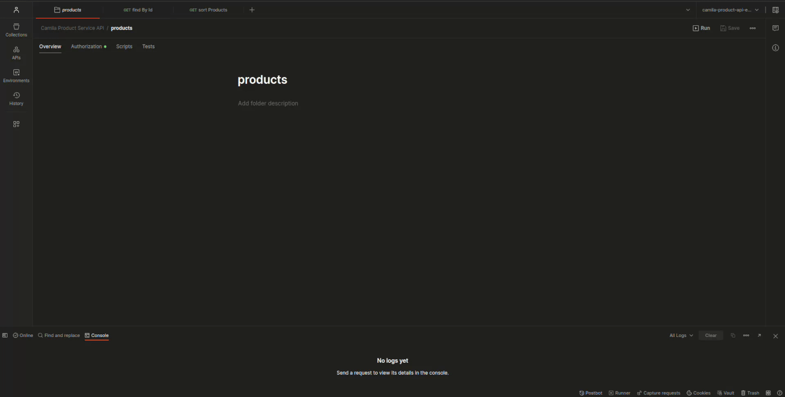

# camila-product-api

> Microservice example

Implementa:
- Paradigma: [Reactivo](https://projectreactor.io/learn)
- Arquitectura: [Hexagonal](https://alistair.cockburn.us/hexagonal-architecture/)
- Comunicación: [Rest](https://en.wikipedia.org/wiki/REST), [Graphql](https://graphql.org/), [Websocket](https://en.wikipedia.org/wiki/WebSocket), [Rsocket](https://rsocket.io/)

---

## Pre-condiciones

* JDK >= 21
* Docker >= 24.0.6
* Maven >= 3.8.8
* Spring >= 6.x
* Spring-boot >= 3.2.x
* MongoDB >= 7.x
* Couchbase >= 7.x
* Native Image compilation
  * GraalVM >= 21.0.1+12.1
  * GCC >= (linux, x86_64, 11.4.0)
    * `zlib1g-dev`

---

## Arquitectura

```txt
📦api
 ┣ 📂product
 ┃ ┣ 📂domain
 ┃ ┣ 📂application
 ┃ ┃ ┣ 📂usercase
 ┃ ┃ ┗ 📂port
 ┃ ┃   ┣ 📂input
 ┃ ┃   ┗ 📂output
 ┃ ┗ 📂framework
 ┃   ┗ 📂adapter
 ┃     ┣ 📂input
 ┃     ┃ ┣ 📂security
 ┃     ┃ ┣ 📂rest
 ┃     ┃ ┣ 📂graphql
 ┃     ┃ ┣ 📂websocket
 ┃     ┃ ┗ 📂rsocket
 ┃     ┗ 📂output
 ┃       ┣ 📂mongo
 ┃       ┗ 📂couchbase
 ┗ 📜ProductApiApplication.java
```


---

## Enlaces

* Rest API DOC: <http://localhost:8080/product-dev/api/swagger-ui.html>
* Graphql API DOC: <http://localhost:8080/product-dev/api/graphiql>

---

## Ejemplos de petición API

### Rest API



```bash
curl -X 'GET' \
  'http://localhost:8080/product-dev/api/products?salesUnits=0.80&stock=0.20&page=0&size=20' \
  -H 'Accept: application/json'

# Server-sent Event (SSE)
curl -X 'GET' \
  'http://localhost:8080/product-dev/api/products?salesUnits=0.80&stock=0.20&page=0&size=20' \
  -H 'Accept: text/event-stream'

# NDJSON: https://github.com/ndjson/ndjson-spec
curl -X 'GET' \
  'http://localhost:8080/product-dev/api/products?salesUnits=0.80&stock=0.20&page=0&size=20' \
  -H 'Accept: application/x-ndjson'
  
curl -X 'GET' \
  'http://localhost:8080/product-dev/api/products/1' \
  -H 'Accept: application/json'
```

> [3 techniques to stream JSON in Spring WebFlux](https://nurkiewicz.com/2021/08/error-handling-in-json-streaming-with-webflux.html)

### Graphql API


```bash
curl --location 'http://localhost:8080/product-dev/api/graphql' \
  --header 'Accept: application/json' \
  --header 'Content-Type: application/json' \
  --data-raw '{"query":"query sortProducts($salesUnits: Float, $stock: Float, $page: Int, $size: Int, $withDetails: Boolean!) {\n    sortProducts(salesUnits: $salesUnits, stock: $stock, page: $page, size: $size) {\n        id @include(if: $withDetails)\n        internalId @include(if: $withDetails)\n        category @include(if: $withDetails)\n        name\n        salesUnits\n        stock\n    }\n}\n","variables":{"salesUnits":0.001,"stock":0.999,"page":0,"size":2,"withDetails":false}}'

curl --location 'http://localhost:8080/product-dev/api/graphql' \
  --header 'Accept: application/json' \
  --header 'Content-Type: application/json' \
  --data '{"query":"query findById($internalId: ID) {\n  findById(internalId: $internalId) {\n    id, internalId, category, name, salesUnits, stock\n  }\n}\n","variables":{"internalId":"1"}}'
```

### Websocket


---

## Pruebas

[Test - Readme](src/test/Readme.md)

---

## Operaciones (build, deploy)

[Operar - Readme](.operate/Readme.md)

---

## Notas:

### Ejemplo de agregación de `products` con filtro de `sales units` y `stock` ponderada en `mongodb`

```bash
db.products.aggregate([
  {
    $addFields: {
      weightedScore: {
        $add: [
          {
            $multiply: ["$salesUnits", 0.80]
          },
          {
            $multiply: [
              {
                $divide: [
                  {
                    $sum: {
                      $map: {
                        input: { $objectToArray: "$stock" },
                        as: "size",
                        in: "$$size.v"
                      }
                    }
                  },
                  {
                    $size: { $objectToArray: "$stock" }
                  }
                ]
              },
              0.20
            ]}]}}},
  {
    $sort: {
      weightedScore: -1
    }}
]);
```
